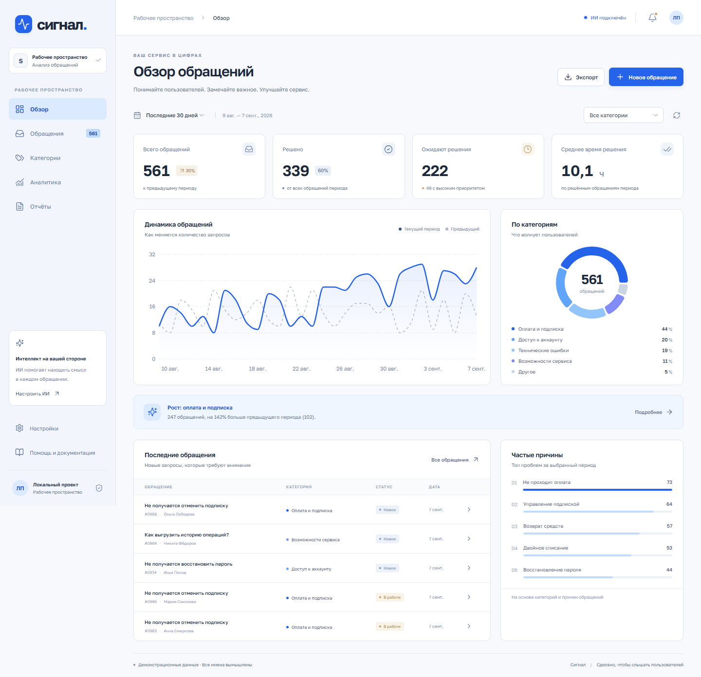

# Сигнал — анализ обращений пользователей

Веб-приложение для хранения обращений, работы поддержки и анализа частых проблем. ИИ определяет категорию, причину, приоритет и краткое содержание запроса, а также составляет аналитические отчёты. Русскоязычный интерфейс в бело-синей палитре адаптирован для компьютера и телефона.



## Реализованная функциональность

- Хранение обращений в SQLite; данные сохраняются после перезапуска.
- Создание, список с пагинацией и подробная карточка обращения.
- Поиск по тексту, имени, email, причине и номеру; поддерживается кириллица без учёта регистра.
- Фильтры по периоду, категории, статусу, приоритету, каналу и тегу.
- Категоризация с ИИ, ручная корректировка и резервная классификация по ключевым словам.
- Теги, изменение статуса и история правок; защита от конфликтов параллельного редактирования.
- Статистика: количество обращений, доля решённых, открытые запросы и среднее время решения.
- Интерактивные графики, категории, рейтинг частых причин и каналы связи.
- Сравнение периодов и уведомления о резком росте категории.
- Аналитические отчёты, скачивание TXT и экспорт CSV для Excel.
- REST API и настройка подключённой модели ИИ.

Технологии: **React, Node.js 24+, Express, SQLite, Recharts, локальный сервер ИИ**.

## Быстрый запуск

Установите **Node.js 24 или новее** и Git. В терминале выполните:

```sh
git clone https://github.com/tihonovivan737-cmd/signal.git
cd signal
npm ci
npm run build
npm run seed
npm start
```

Откройте **[http://127.0.0.1:3001](http://127.0.0.1:3001)**.

`npm run seed` — необязательный шаг: добавляет 991 вымышленное обращение за последние 60 дней только в пустую базу. Для работы только со своими данными пропустите его. Повторная команда не меняет заполненную базу.

Сервис запускается и без ИИ: хранение, поиск, графики, экспорт и классификация по ключевым словам работают самостоятельно. Источник анализа всегда обозначен в интерфейсе.

Остановка: `Ctrl+C`. Повторный запуск: `npm start`. База создаётся в `data/signal.sqlite`. Python и отдельный сервер базы данных не требуются.

## Подключение ИИ

1. Запустите совместимый локальный сервер генерации на `http://127.0.0.1:11434`. Сервер должен поддерживать `GET /api/tags` и `POST /api/generate` с JSON-схемой в поле `format` и `stream: false`.
2. При необходимости скопируйте `.env.example` в `.env` и укажите адрес и установленную текстовую модель:

   ```dotenv
   AI_URL=http://127.0.0.1:11434
   AI_MODEL=qwen2.5:3b
   AI_TIMEOUT_MS=90000
   ```

3. Если сервер поддерживает загрузку через `POST /api/pull`, выполните `npm run ai:prepare`. Команда загружает выбранную модель в уже запущенный сервер; сам сервер не устанавливает и не запускает. При другом способе установки загрузите модель средствами вашего сервера.
4. Выполните `npm run ai:check` для проверки реальной классификации и отчёта. Проверка не записывает обращения в рабочую базу.
5. На странице **Настройки** выберите установленную текстовую модель. Модели векторных представлений не подходят для генерации.

Первый ответ может занять более минуты. По умолчанию ожидание ограничено 90 секундами. При недоступности модели или некорректном ответе используется явно обозначенный резервный результат. Сохранённое обращение не теряется; анализ можно повторить из карточки.

## Настройки

`.env` необязателен. Без него используются значения по умолчанию:

| Переменная | Значение | Назначение |
|---|---|---|
| `HOST` | `127.0.0.1` | Адрес приложения |
| `PORT` | `3001` | Порт приложения |
| `DB_PATH` | `./data/signal.sqlite` | Файл базы |
| `AI_URL` | `http://127.0.0.1:11434` | Сервер ИИ |
| `AI_MODEL` | `qwen2.5:3b` | Начальная модель |
| `AI_TIMEOUT_MS` | `90000` | Таймаут генерации, мс |

Модель, сохранённая через интерфейс, имеет приоритет над `AI_MODEL`. При обновлении старой базы настройки и результаты анализа переводятся на нейтральные названия автоматически. Сообщение Node.js об отсутствующем `.env` не является ошибкой.

Для разработки выполните `npm run dev`. Интерфейс: [http://127.0.0.1:5173](http://127.0.0.1:5173), API: порт 3001. При изменении порта API также измените прокси в `vite.config.js`.

## Работа с приложением

1. **Новое обращение:** заполните тему, текст и автора. ИИ-анализ запускается после сохранения, если включена соответствующая опция.
2. **Обращения:** используйте поиск и фильтры; откройте карточку, измените статус, категорию, причину, приоритет или теги и сохраните правки.
3. **Обзор / Аналитика:** выберите период; графики и сравнение пересчитываются с учётом фильтров. Нажатие на категорию открывает соответствующие обращения.
4. **Отчёты:** сформируйте сводку по выборке и скачайте TXT. Кнопка **Экспорт** выгружает CSV со статистикой или полными обращениями.

CSV использует UTF-8 BOM, разделитель `;` и экранирование формул. Открывается в Excel или LibreOffice. Экспорт обращений включает контактные данные; статистический экспорт содержит агрегированные показатели.

## Расчёт показателей

- Даты и границы периодов — UTC. Начальная и конечная даты включаются полностью; допустим период 1–366 дней.
- Выборка определяется датой **создания**. «Решено» — обращения выборки со статусом «Решено» **сейчас**, а не число закрытий за период.
- Среднее время решения: часы от создания до закрытия среди решённых обращений. При переоткрытии дата закрытия очищается; повторное решение фиксирует новую дату.
- Предыдущий период имеет ту же длину и заканчивается за день до текущего. Изменение: `(текущий − предыдущий) / предыдущий × 100%`. При нулевой базе процент не вычисляется.
- Уведомление появляется при росте категории от 50%, если ранее было хотя бы 5 обращений, а сейчас — хотя бы 10. Внешних рассылок нет.
- Фильтры одинаково применяются к списку, статистике и экспорту. Проценты категорий округляются.

## Структура проекта

```text
src/            React-интерфейс и адаптивные стили
server/         REST API, SQLite, аналитика и подключение ИИ
scripts/        Разработка, подготовка и проверка ИИ
tests/          Серверные и браузерные тесты
public/         Статические ресурсы
docs/           Документация и описание функциональности
data/           Рабочая база; не включается в репозиторий
```

Таблицы: `tickets` — обращения, `tags` — теги, `ticket_tags` — связь многие ко многим, `events` — история, `settings` — настройки. Включены транзакции, внешние ключи, индексы и WAL. SQL-запросы параметризованы, входные данные проверяются.

## Тестирование

```sh
npm test
npm run build
npx playwright install chromium
npm run test:e2e
```

Тесты проверяют хранение, поиск, фильтры, даты, статистику, экспорт, сбои ИИ, миграцию настроек, конфликты правок, создание карточек и мобильную навигацию. Все тесты изолированы от рабочей базы. Реальная модель отдельно проверяется командой `npm run ai:check`.

## Обработка данных и ограничения

Это локальное рабочее пространство **без авторизации и разграничения ролей**. По умолчанию сервер доступен только на этом компьютере. Для интернет-развёртывания потребуются авторизация, HTTPS и ограничение запросов.

ИИ получает тему и текст. Отдельные поля имени и email не отправляются; email и длинные номера в тексте маскируются. Это не полная анонимизация произвольного текста. Для отчёта передаётся агрегированная статистика. При изменении `AI_URL` данные направляются на указанный сервер.

ИИ может ошибаться; результаты можно исправлять вручную. При остановке приложения незавершённый анализ потребуется повторить, но обращение сохранится. Допускается до двух параллельных классификаций и один отчёт.

Статистика рассчитана на учебные и небольшие рабочие объёмы. Для миллионов записей потребуются SQL-агрегации, полнотекстовый индекс и очередь анализа. XLSX, подключение реальной почты и облачная синхронизация в эту версию не входят.

Для резервного копирования остановите приложение и скопируйте `data`. Для новой пустой базы укажите другой `DB_PATH`.

## Документация

- [REST API](docs/API.md)
- [Проектирование и тестирование](docs/PROJECT.md)
- [Краткое описание для сдачи](docs/SUBMISSION.md)

Лицензия: [MIT](LICENSE).
